# HISTORIAS DE USUARIO

## Historia de Usuario 1: Registrar usuario
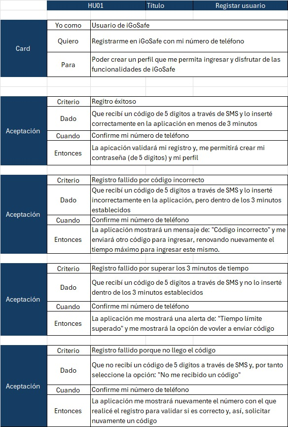

## Historia de Usuario 2: Crear contraseña y perfil

## Historia de Usuario 3: Iniciar sesión
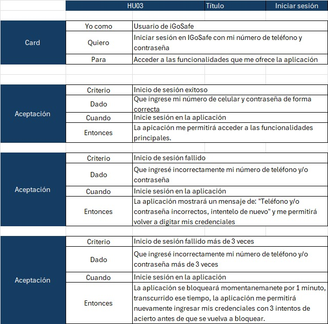

## Historia de Usuario 4: Ceder permisos
  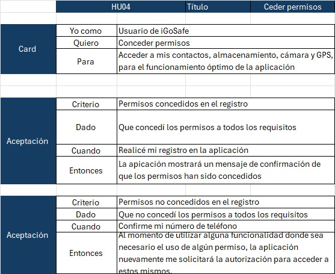

## Historia de Usuario 5: Seleccionar ruta vehicular
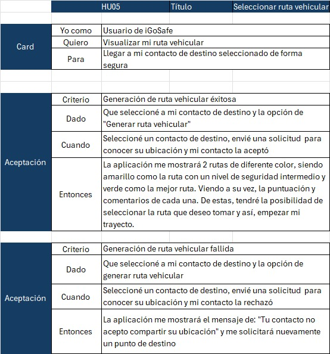

## Historia de Usuario 6: Seleccionar ruta peatonal
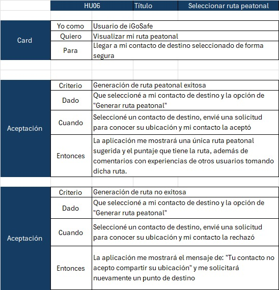

## Historia de Usuario 7: Compartir ubicación
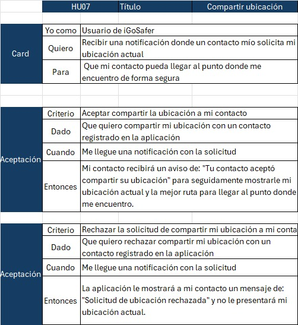

## Historia de Usuario 8: Calificar ruta
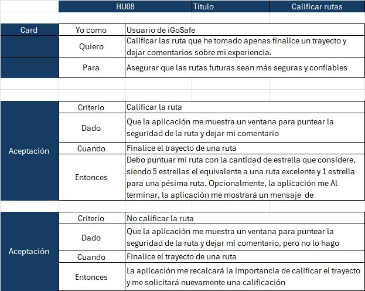

## Historia de Usuario 9: Agregar contactos favoritos para viajar
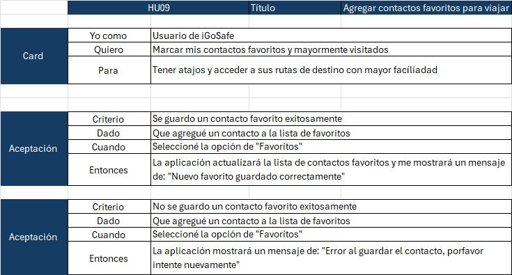

## Historia de Usuario 10: Ver contactos
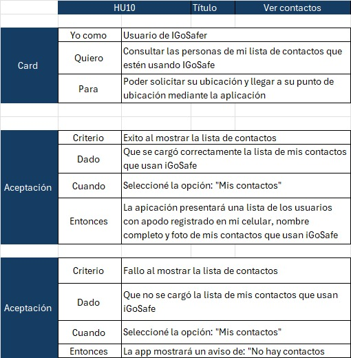

## Historia de Usuario 11: Ascender de plan
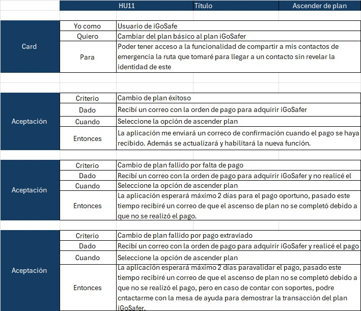

## Historia de Usuario 12: Seleccionar contactos de emergencia
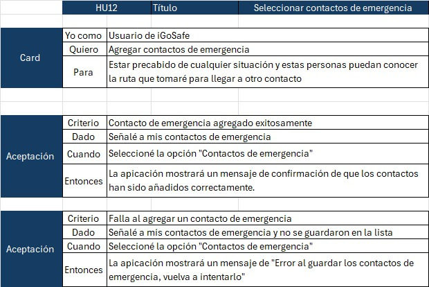

## Historia de Usuario 13: Compartir ruta con un contacto de emergencia
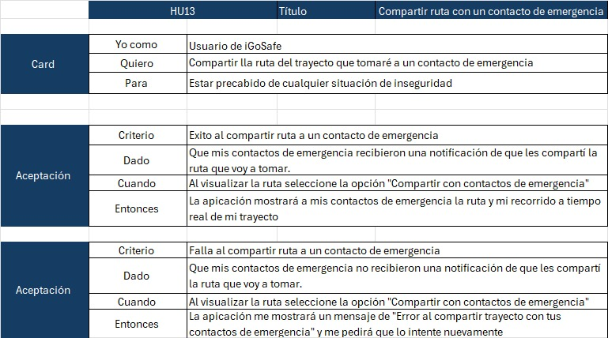
