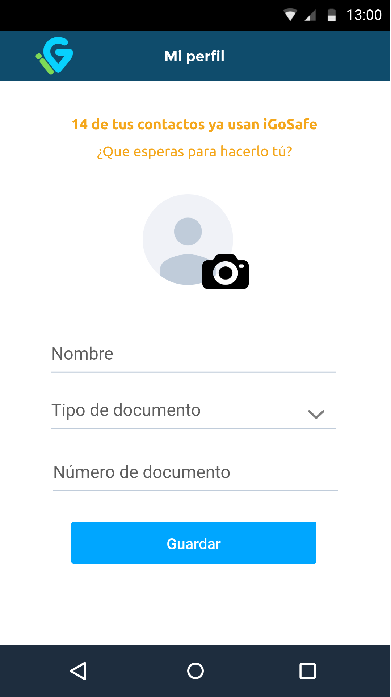
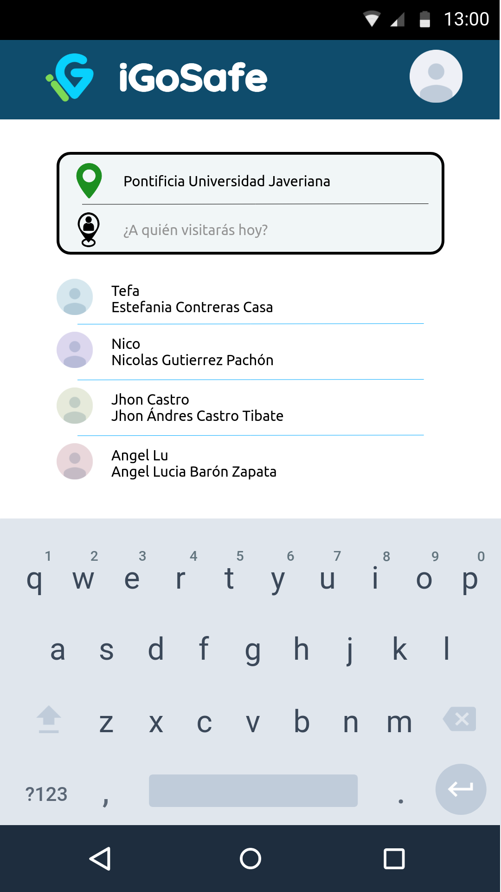
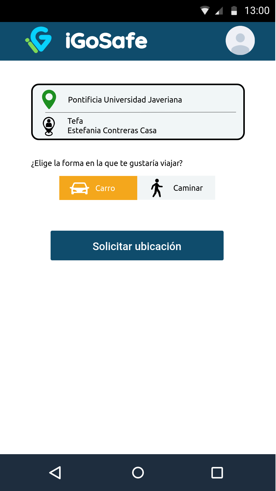
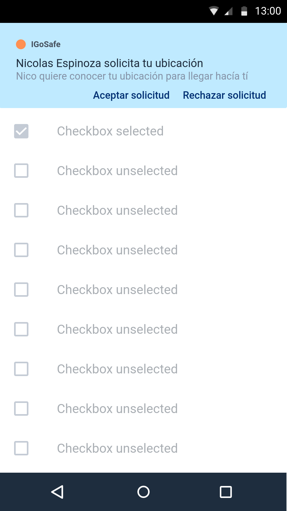
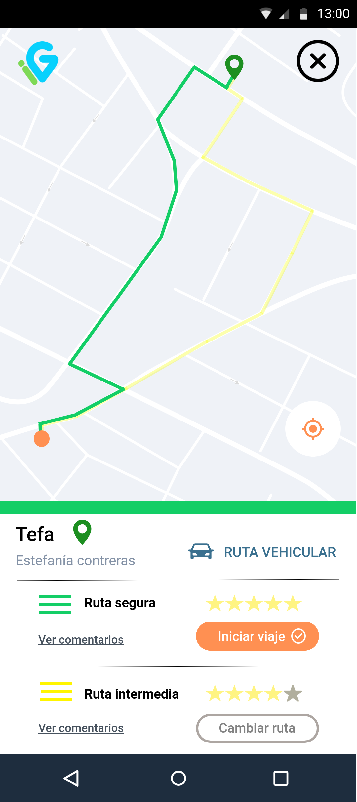

# Manual de usuario
Aquí encontrarás un manual de usuario para el uso de nuestro aplicativo  
Primero, al abrir la app se encontrará un sistema de loggin que se constituye de tu número de celular y tu contraseña. 
Dandote la oportunidad de poder recuperar esta última si se te ha olvidado, y si no tienes una cuenta aún, la forma de crearla presionando sobre el texto “Comenzar a usar iGoSafe”.

  
   Pantalla principal iGoSafe

Como va a ser la primera vez usando la aplicación entonces se va a crear la cuenta, apareciendo estas siguientes pantallas que piden el recibimiento de un código SMS para verificar e incluir este número de celular como perteneciente a un usuario de iGoSafe y continuar con la creación de contraseña.

  
  
  
   Pantalla de verificación SMS y registro de cuenta

### Registro 📝 

Al darle click en el botón de registro te llevara a esta nueva pantalla donde pondras tus datos para crear una cuenta, tambien podras asignar una foto de perfil desde tu galeria o tomar una en el momento de crear la cuenta. 

  
   Pantalla de registro cliente

### Menu principal  

Una vez iniciada la sesión se encontrará la opción de seleccionar los puntos a llegar y de partida, y a su vez la modalidad en la que se va a llegar a este punto en un automovil o caminando. 

  
   Pantalla principal de recorrido

A su vez, cuando se quiere elegir el punto al cuál se quiere llegar, aparecerán los usuarios de confianza, donde si se decide seleccionar, se le enviará una notificación al otro usuario después de presionar el botón “Solicitar Ubicación” y se dará la ruta para llegar a esta persona. 

  
   Lista de personas de confianza a la cual dirigirse

### Solicitar Ubicación 

 En el momento en el que el usuario ha marcado como destino a otro usuario, este recibirá un mensaje de solicitud para retribuir la ubicación exacta o no.
 

  
   Solicitud de ubicación

### Ruta

Si el usuario al que solicitó la ubicación acepta compartirla, se generará una ruta y se mostrarán la calificación de esta misma.

  

