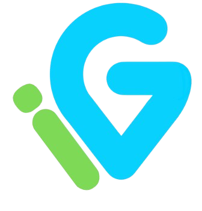
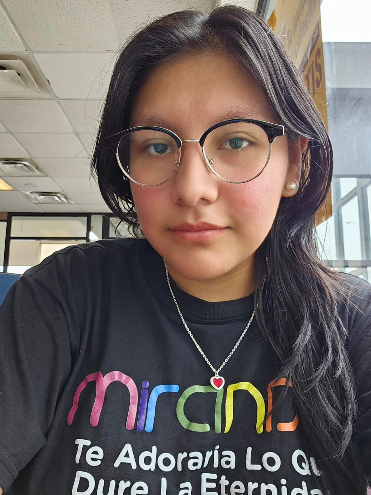
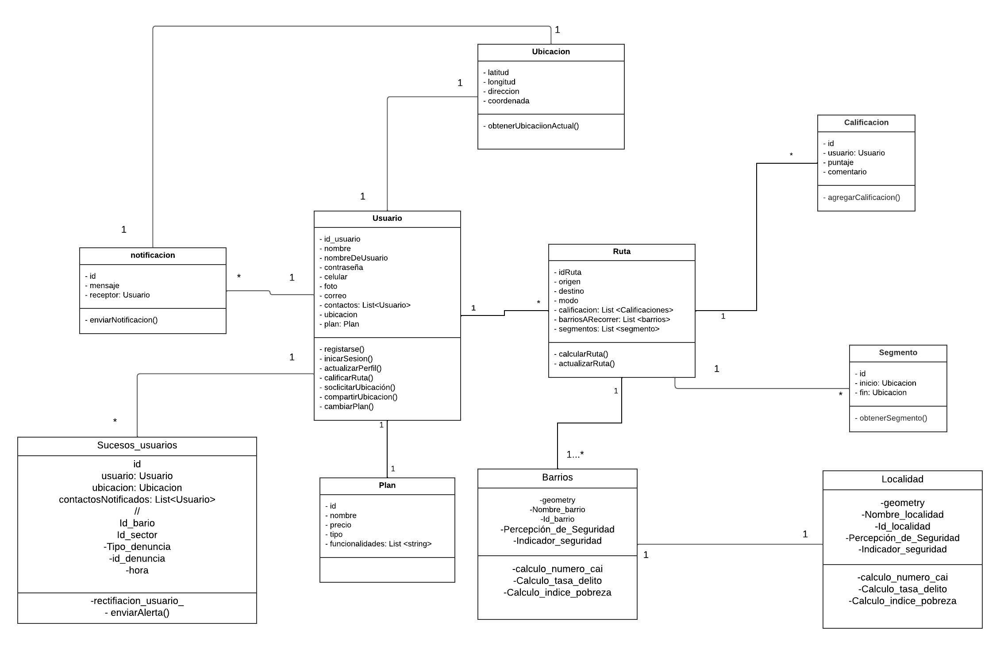
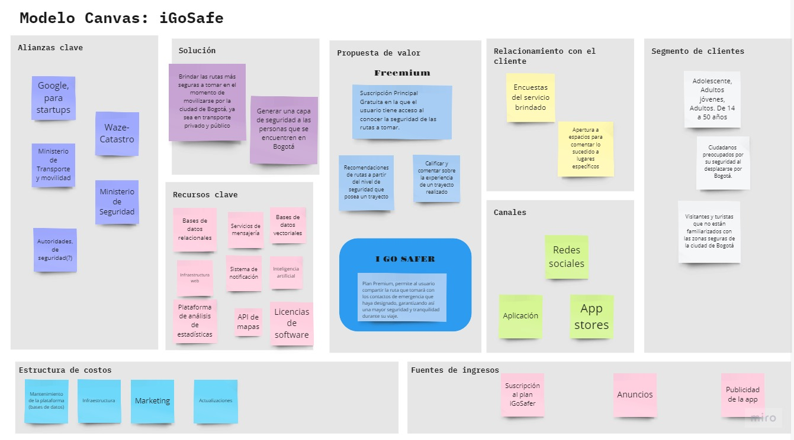

  <h1>
  
    iGoSafe
  </h1>

**Equipo Los Surfers**

## Descripción del Proyecto

**iGoSafe** es una innovadora aplicación para Android que está diseñada para proporcionar rutas seguras en Bogotá. La aplicación permite a los usuarios llegar de manera segura a la ubicación de contactos registrados, asegurando un viaje sin preocupaciones. 

Con funcionalidades que incluyen la capacidad de calificar y ajustar rutas basadas en la seguridad, **iGoSafe** proporciona tranquilidad durante los desplazamientos al garantizar que solo se pueda seleccionar como destino la ubicación de un contacto registrado.

- **Rutas Seguras**: Obtén rutas diseñadas para maximizar la seguridad durante tu viaje.
- **Calificación de Rutas**: Evalúa y ajusta las rutas basadas en tu experiencia y seguridad.
- **Ubicación de Contactos**: Solo puedes seleccionar como destino la ubicación de contactos registrados, garantizando un viaje seguro y controlado.

## Integrantes del equipo

  <h1>Jocelyne Gonzalez Hernandez</h1>
  

  
  <strong>María José Cárdenas Machaca</strong>

   <h1>Neyl Peñuela Bernate
  
  </h1>

## ENTREGABLES
### DIAGRAMA INICIAL DE CLASES

### LEAN CANVAS

### CASOS DE USO
