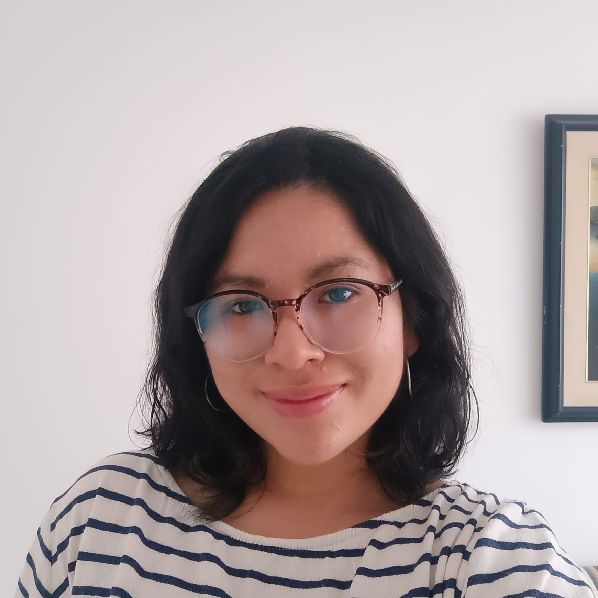

## Integrantes del equipo

  <h3>Jocelyne Gonzalez Hernandez</h3>
  
  
Estudiante de la licenciatura en <b>Ingeniería en Tecnologías de Cómputo y Telecomunicaciones</b> de la <b>Universidad Iberoamericana de la Ciudad de México.</b>
  
  
Me apasionan los conciertos, la fiesta y salir a conocer lugares nuevos.

  <h3>María José Cárdenas Machaca</h3>
  
  
Estudiante de ingeniería de sistemas de la Pontificia Universidad Javeriana. 

  
ColomboPeruana.

  
En mis tiempos libres me gusta ver series y dibujar. Mi animal favorito son los gatos.

   <h3>Neyl Peñuela Bernate</h3>
  
  
Estudiante de Ciencia de datos con experiencia en el uso de base de datos geoespaciales, y creación de indicadores de análisis Multivariado.

  
Me gusta escribir poesía, y crear canciones. Además que me encantan los gatos y el R&B.

  
"Con empatía todo se construye mejor."

